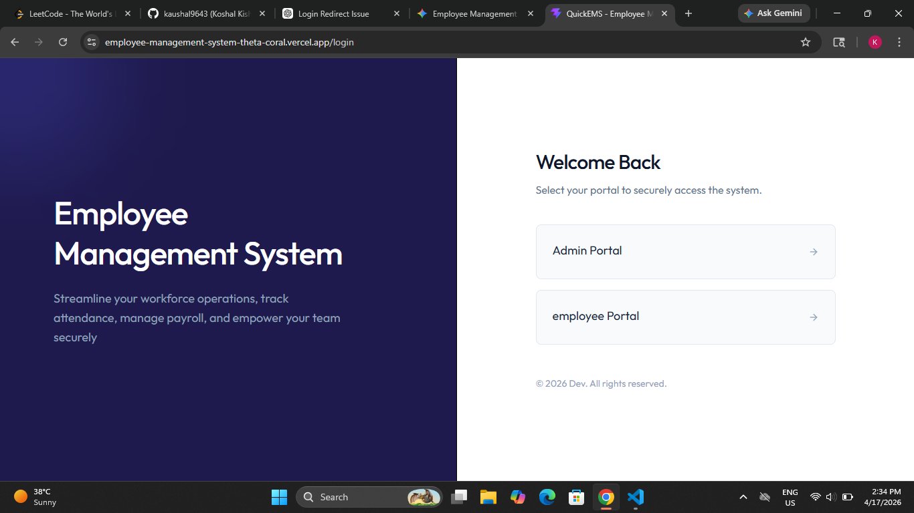
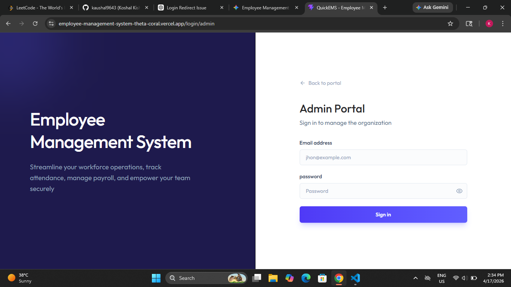
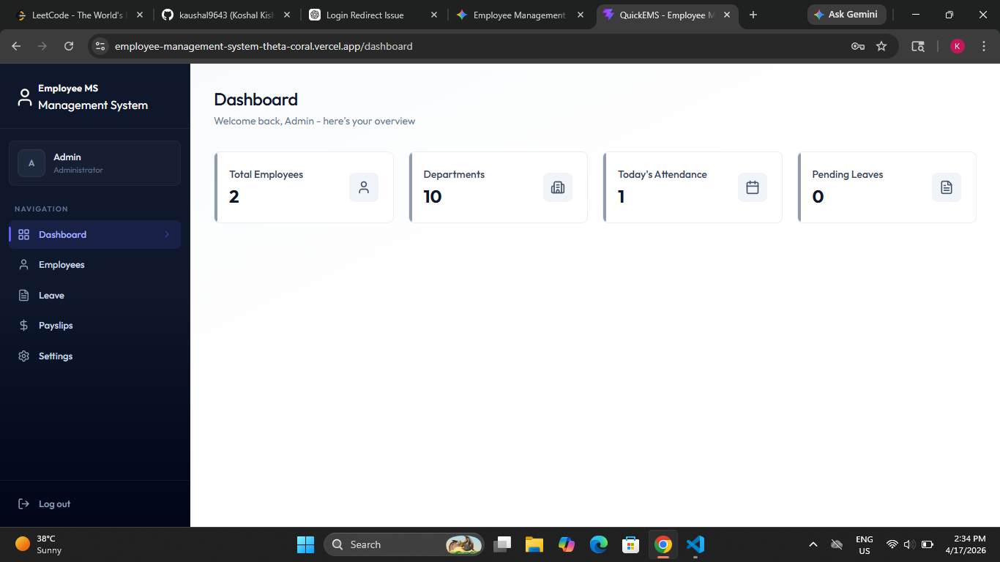
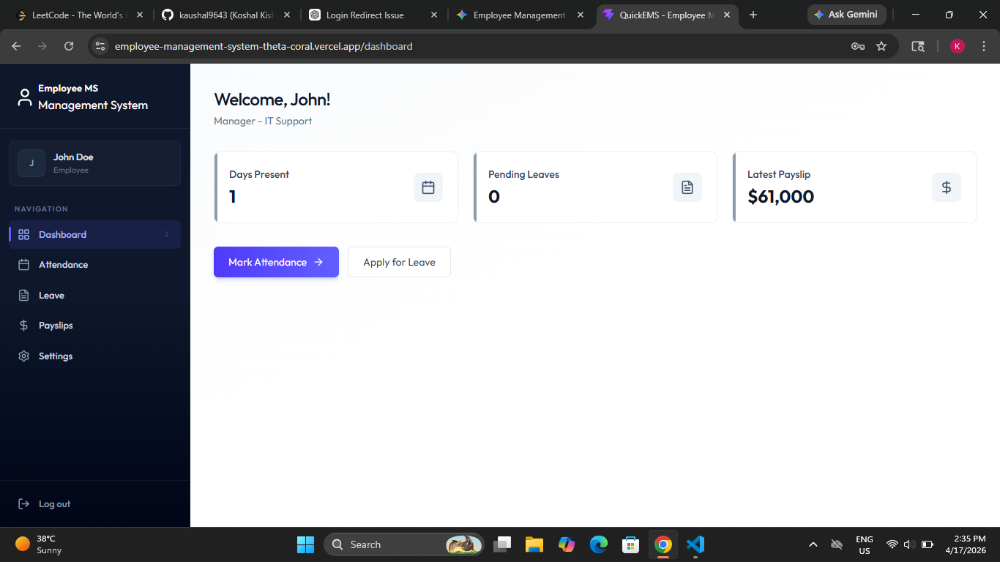
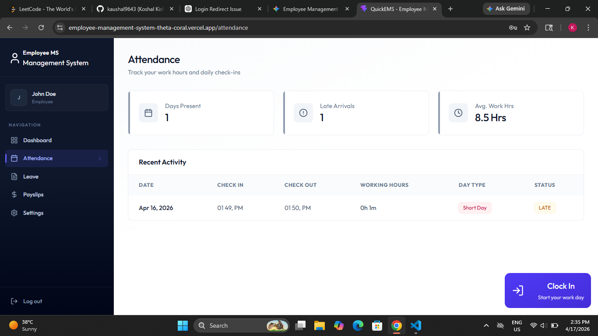
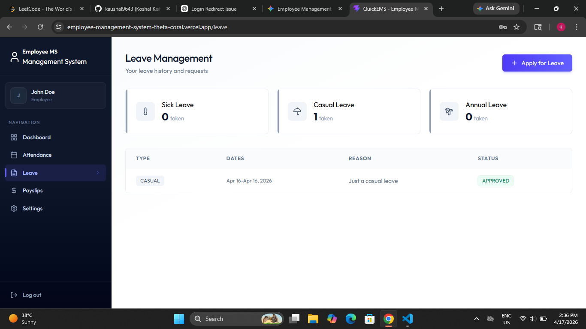
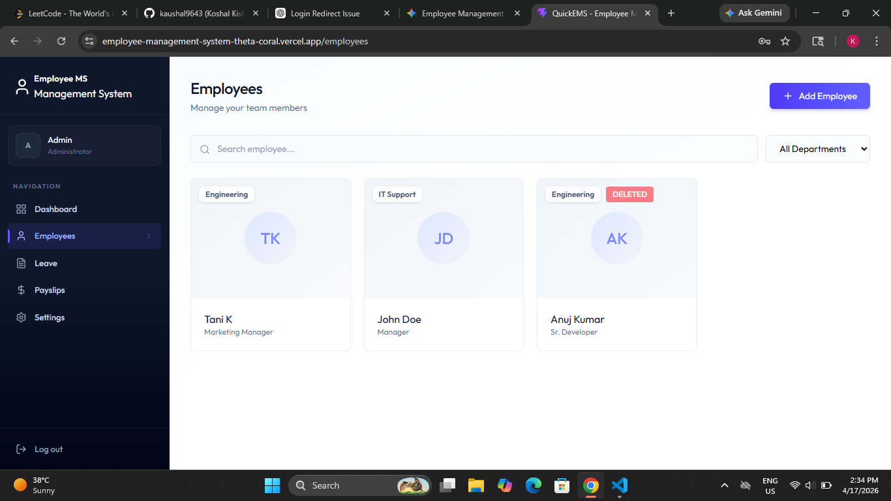
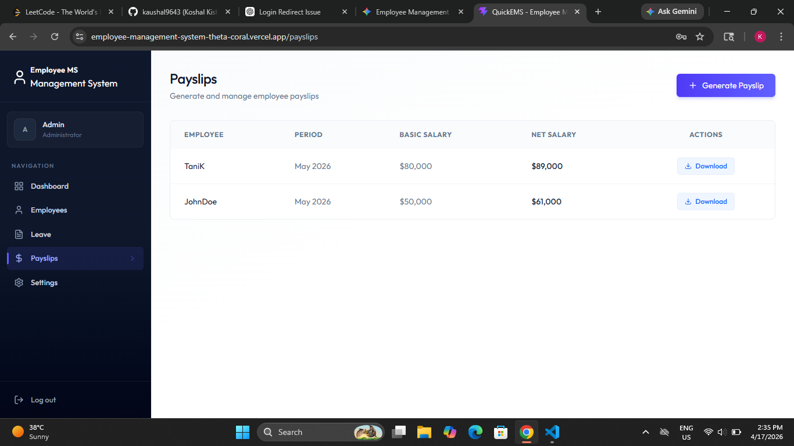
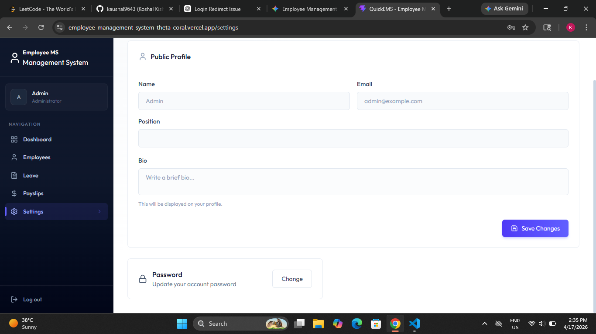

# 🚀 Employee Management System (MERN Stack)

A full-stack Employee Management System built using the MERN stack that allows organizations to manage employees, attendance, leaves, and payslips efficiently.

---

## 📌 Features

### 👨‍💼 Employee Features
- Clock In / Clock Out functionality  
- View attendance history  
- View generated payslips  
- Update profile information  
- Change password securely  

### 🛠️ Admin Features
- Manage employees (create, update, soft delete)  
- Generate monthly payslips  
- View all employee attendance records  
- Approve / reject leave applications  

### ⏱️ Attendance System
- Daily check-in and check-out tracking  
- Automatic working hours calculation  
- Day type classification:
  - Full Day  
  - Half Day  
  - Short Day  

### 💰 Payslip Management
- Generate payslips with:
  - Basic Salary  
  - Allowances  
  - Deductions  
- Automatic net salary calculation  

---

## 🧰 Tech Stack

### Frontend
- React.js  
- Tailwind CSS  
- Axios  

### Backend
- Node.js  
- Express.js  
- MongoDB (Mongoose)  

### Tools & Services
- Express Session (Authentication)  
- Nodemailer (Email Service)  
- Inngest (⚠️ Implemented but currently disabled)  

---

## 📸 Screenshots

### 🏠 Login & Role(Admin or Employee)

<p align="center">
  
  
</p>

---
### 🏠 Dashboard & Attendance

<p align="center">
  
  
  
</p>

---

### 💰 Leave & 👤 Employees

<p align="center">
  
  
</p>

---
### 💰 Payslip & 👤 Profile or Setting

<p align="center">
  
  
</p>

---

## ⚙️ Installation & Setup

### 1️⃣ Clone the repository

```bash
git clone https://github.com/kaushal9643/Employee-Management-System
cd Employee-Management-System
```

### 2️⃣ Install dependencies

#### Frontend
```bash
cd client
npm install
```

#### Backend
```bash
cd ../server
npm install
```

3. **Create .env files**
- Client (client/.env)
```
VITE_BASE_URL="http://localhost:4000"
```
- Server (server/.env)
```
PORT=4000
MONGO_URI=your_mongodb_connection
JWT_SECRET=your_secret
ADMIN_EMAIL=your_admin_email
INNGEST_EVENT_KEY=your_event_key
INNGEST_SIGNING_KEY=you_signing_key
SMTP_USER=your_email
SMTP_PASS=your_password
SENDER_EMAIL=sender_email
```
## Deployment 🌐

The frontend and backend can be deployed on **Vercel** or any cloud hosting platform.  

## Live Demo 🌐

Check out the app here: [EMS Live Demo](https://employee-management-system-theta-coral.vercel.app/login)
 -->

### 📌 Notes
- Inngest automation is implemented but currently disabled in production.
- Session-based authentication is used (Express Session).
- Ensure MongoDB is running before starting the backend.